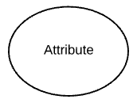
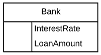
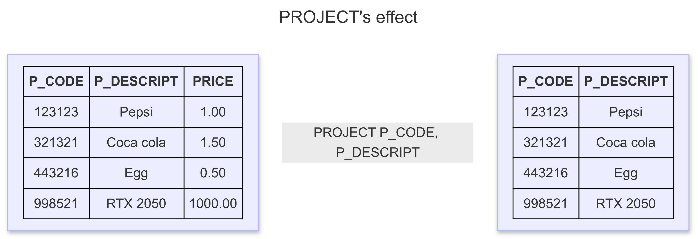
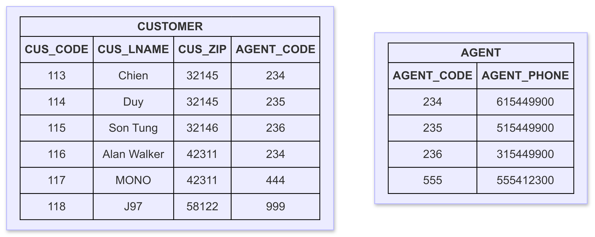

# Database Systems

Hello 👋

In this blog post, I'll be diving deep into relational database design, which remains the cornerstone of modern database management systems. As one of the most widely used database types, relational databases are behind many critical systems you interact with daily, whether you're making an online purchase, managing your finances, or accessing a web application.

> [!NOTE]
> The content of my blog is gathered from various sources, including the internet and books. It primarily covers fundamental knowledge about database design.

## What Is A Database?

A database is an organized collection of data, designed to model a specific organizational process or system. Databases allow users to store, manage, and retrieve data efficiently. Whether you're using a simple spreadsheet to track personal expenses or a complex database management system to handle millions of records for a large enterprise, the underlying idea is the same—data is stored in a structured way to meet a specific goal or need.

Databases are typically categorized into two types: **operational databases** and **analytical databases**.

### Operational Databases

Operational databases are designed to handle **online transaction processing (OLTP)**, meaning they manage day-to-day operations of an organization. These databases are dynamic, with frequently changing data that reflects up-to-the-minute information. For instance, when you make a purchase online, your transaction data is stored in an operational database, which updates inventory and processes the order in real-time. These systems are optimized for fast, real-time data retrieval and updates.

### Analytical Databases

In contrast, analytical databases are built for **online analytical processing (OLAP)**, used primarily for analyzing large amounts of historical data. These databases track long-term trends, perform complex queries, and support business intelligence tasks. Data in analytical databases is typically **static**, meaning it doesn't change once it's recorded. Industries like finance, marketing analytics, and scientific research often rely on analytical databases to make informed business or research decisions based on historical patterns.

## The Relational Database

Invented in 1969 by **Dr. Edgar F. Codd**, the relational database model revolutionized how data is stored and queried. Dr. Codd, an IBM researcher with a background in mathematics, envisioned a new way to manage data that minimized redundancy, increased data integrity, and was independent of physical storage methods. His relational model was first presented in his 1970 paper _"A Relational Model of Data for Large Shared Data Banks"_.

At its core, the relational database is based on two main mathematical concepts: **set theory** and **first-order predicate logic**. The term "relational" itself is derived from set theory, where data is organized into sets of tuples (or records), and these sets can be manipulated using logical operations.

In a relational database:

- Data is stored in **relations**, commonly known as **tables**.
- Each table consists of **tuples** (also called records or rows) and **attributes** (or columns).
- The order of records and fields within a table does not affect the data's integrity, which ensures that the data is independent of how it's physically stored.

This independence from physical storage allows relational databases to offer a powerful abstraction: you don't need to know where or how the data is stored in order to retrieve it, which simplifies querying and management.

### Types of Relationships in Relational Databases

Relational databases define three basic types of relationships between tables:

1. **One-to-One**: Each record in one table is linked to a single record in another table.
2. **One-to-Many**: A single record in one table can be related to multiple records in another table.
3. **Many-to-Many**: Multiple records in one table can be linked to multiple records in another table.

These relationships are typically established by shared attributes (fields), with foreign keys ensuring that data is consistent across related tables. Understanding and properly managing these relationships is crucial for maintaining the integrity and performance of a database.

### Relational Database Management Systems (RDBMS)

A **relational database management system (RDBMS)** is software that facilitates the creation, management, and querying of relational databases. RDBMS platforms provide tools for users to define the structure of the database, insert and modify data, and execute queries to retrieve information. They also enforce integrity constraints, manage security, and often provide features for transaction processing and backup.

Popular RDBMS examples include:

- **PostgreSQL**: Known for its advanced features and extensibility.
- **MySQL**: A widely-used open-source RDBMS that is popular in web development.
- **SQLite**: A lightweight, serverless RDBMS ideal for local storage in mobile apps or desktop software.

The quality and performance of an RDBMS depend largely on how well it adheres to the relational model, ensuring that operations like querying, updating, and deleting data are both efficient and consistent.

## Terminology

Before diving into the design process of relational databases, it's crucial to understand certain terminology. These terms are foundational to the way relational databases function. Broadly speaking, relational database terminology can be classified into four categories: **value-related**, **relationship-related**, **structure-related**, and **integrity-related**.

### Value-Related Terms

#### Data

**Data** refers to raw facts that are stored in a database. These facts are typically **static**, meaning they remain in the same state until they are modified. Data is the basic unit of storage, and it doesn't have any inherent meaning until processed. In the context of a database, data could be things like customer names, product prices, or transaction dates.

The key idea here is that **data by itself does not reveal its significance**—it needs to be processed to turn it into something useful, like information.

#### Information

**Information** is the outcome of processing data to give it context and meaning. Unlike data, information is **dynamic**, because it changes based on the underlying data. When you retrieve information from a database, for example through an SQL SELECT query, you're transforming raw data into something that's useful or meaningful.

A simple way to remember the difference:

> **Data is what you store. Information is what you retrieve.**

#### Null

**Null** represents a missing or unknown value in a database. It's important to note that **Null is not the same as zero** or an empty string. While zero might represent something (like a balance of zero in an account), an empty string could indicate a user leaving a field blank, both of which are meaningful in their own right. However, **Null simply indicates the absence of any data**.

#### The Value of Null

Null has its place when dealing with missing or undefined values. For instance:

- **Missing values** occur when a piece of information is absent, like forgetting to input a client's country name during data entry.
- **Unknown values** may arise when information is not yet available, such as when a client forgets their country name.

In certain situations, Null can also be used to represent something that is not applicable. However, in cases like these, it's often more helpful to use specific values like "N/A" (Not Applicable) instead of Null to provide clearer context.

#### The Problem with Null

While Null is useful, it does have some drawbacks, especially when performing mathematical or logical operations. For example, any arithmetic operation involving Null will return Null, which can lead to unexpected results. If a calculation involves missing data (such as "1 + Null"), the result is logically uncertain, so it will also be Null.

This issue is something that will be considered during the database design process, especially when dealing with aggregates and calculations.

### Structure-Related Terms

#### Table

In a relational database, **data is stored in tables**, which are also referred to as **relations**. A table is essentially a collection of records (or tuples), organized by fields (or attributes). Tables represent specific subjects in a database, and the data within them must be logically organized.

The order of records and fields doesn't matter—what is crucial is the uniqueness of data and the relationships between tables. A table must always contain at least one **primary key** to uniquely identify each record.

#### Field

A **field** (or **attribute**) represents a specific characteristic of the subject represented by the table. For example, in a table of employees, fields might include **Name**, **Email**, **Phone Number**, and **Address**. Fields store actual data, and each field should contain one value—this is part of maintaining a **normalized** database structure.

Common issues arise when fields are poorly designed, such as:

1. **Multipart fields**: A field that contains multiple distinct values (e.g., a full address in a single field).
2. **Multivalued fields**: A field that contains multiple values of the same type (e.g., multiple phone numbers stored in one field).
3. **Calculated fields**: Fields that derive their values from expressions or calculations, like a total price field in an order table.

#### Record

A **record** (or **tuple**) is a complete set of data entries, consisting of one or more fields, that represents a specific instance of the subject of the table. For instance, a record in an "Employees" table would represent an individual employee and contain fields like **Name**, **Email**, and **Phone Number**. Each record is uniquely identifiable by a **primary key**.

#### View

A **view** is a "virtual" table that is generated by querying data from one or more base tables. Unlike a regular table, a view does not store data itself—it only presents data from the underlying tables in a specific format. Views are useful for simplifying complex queries, hiding sensitive data, or combining data from multiple tables.

For example, a view might present a combination of customer and order details from separate tables, allowing you to quickly access combined information.

It's important to note that views can be created in various ways, and while many databases support them, some support **indexed views**, which are stored physically for performance optimization.

#### Keys

In relational databases, **keys** are special fields used to identify and establish relationships between tables. The most important keys are **primary keys** and **foreign keys**.

- A **primary key** is a field (or combination of fields) that uniquely identifies each record in a table. No two records in the table can have the same primary key value.
- A **foreign key** is a field that links one table to another by referencing the primary key in a related table. Foreign keys help enforce referential integrity, ensuring that data is consistently linked between tables.

#### Index

An **index** is a database structure used to improve the speed of data retrieval operations. While an index doesn't change the logical structure of the database, it helps databases quickly locate records by creating an optimized search path for queries. However, an index is not a key, although they both serve to improve query performance.

### Relationship-Related Terms

A **relationship** between tables occurs when records in one table can be linked to records in another. These relationships are formed using **primary keys**, **foreign keys**, or a **linking table** (especially for many-to-many relationships). Understanding these relationships is essential for designing a well-structured database.

#### Types of Relationships

There are three main types of relationships between tables:

1. **One-to-One (1:1)**
2. **One-to-Many (1:M)**
3. **Many-to-Many (M:M)**

#### One-to-One (1:1) Relationship

In a **one-to-one** relationship, each record in Table A is linked to at most one record in Table B, and vice versa. This relationship can be used when, for example, each employee has a unique office assigned to them, and each office is assigned to only one employee.

To implement a one-to-one relationship, the **primary key** of one table can be used as a **foreign key** in the other table, or both tables can share the same primary key.

#### One-to-Many (1:M) Relationship

A **one-to-many** relationship occurs when a single record in Table A can be linked to multiple records in Table B, but each record in Table B is related to only one record in Table A. This is one of the most common relationships in databases. For example, an **author** can write **multiple books**, but each **book** is written by only one **author**.

In a one-to-many relationship, the **primary key** of the "one" side (Table A) is placed as a **foreign key** in the "many" side (Table B).

#### Many-to-Many (M:M) Relationship

In a **many-to-many** relationship, multiple records in Table A can be related to multiple records in Table B. Since relational databases don't support direct many-to-many relationships, a **linking table** (or **associative table**) is used. This table contains **foreign keys** referencing the primary keys of both related tables, creating a bridge between them.

For example, if a **student** can enroll in many **courses**, and a **course** can have many **students**, a linking table like **Enrollments** would contain **student_id** and **course_id** as foreign keys.

#### Types of Participation

**Mandatory participation** occurs when a record in one table must exist before a related record in another table can be added. In contrast, **optional participation** means that a record in the related table is not necessarily required.

#### Degree of Participation

The **degree of participation** refers to the number of records in one table that can be associated with a single record in a related table. For instance, one student may have anywhere from 1 to 5 enrolled courses, which defines the degree of participation for the relationship between **Students** and **Courses**.

### Integrity-Related Terms

#### Field Specification

A _field specification_ (also known as _domain_) defines the characteristics and constraints of a field in a database. It is made up of three components:

- _General elements_: These provide fundamental information about the field, including its _name_, _description_, and _parent table_.
- _Physical elements_: These describe how the field is implemented and presented to users, covering aspects like _data type_, _length_, and _character support_.
- _Logical elements_: These define the values that the field can contain, such as _required values_, _value ranges_, and _null support_.

#### Data Integrity

_Data integrity_ ensures that the data in a database is valid, consistent, and accurate. The accuracy of the data you retrieve is directly proportional to the level of data integrity enforced in the database.

There are four main types of data integrity you'll implement during the database design process. Three of these are related to specific aspects of the database structure, while the fourth focuses on how an organization uses its data. Here's a brief overview of each:

1. **Table-level integrity** (also known as _entity integrity_) ensures that each record in the table is unique, preventing duplicates, and guaranteeing that the field used to identify records (often the primary key) is always non-null.
2. **Field-level integrity** (also known as _domain integrity_) ensures that the structure of each field is valid, and that the data stored in the field is consistent, accurate, and within the expected range. It also ensures that fields of the same type are defined consistently across the database.
3. **Relationship-level integrity** (also known as _referential integrity_) ensures that the relationships between tables are properly maintained. This means that any changes made to data in one table (insertions, updates, or deletions) are synchronized with related tables, preserving the consistency of the database.
4. **Business rules** enforce constraints that are specific to the organization's needs. These rules can influence many aspects of the database design, including the types of values allowed in a field, the participation and degree of participation of tables in relationships, and the synchronization methods used for relationship-level integrity.

## Data Models

### Data Modeling and Data Models

Database design focuses on how the database structure will be used to store and manage data. **Data modeling** is the first step in designing a database, referring to the process of creating a specific data model for a requirement. A **data model** is a relatively simple representation, usually graphical, of more complex real-world data structures.

### Data Model Terminology

The basic building blocks of all data models are _entities_, _attributes_, _relationships_, and _constraints_.

- An **entity** is a person, place, thing, concept, or event about which data will be collected and stored.
- An **attribute** (or field) is a characteristic of an entity.
- A **relationship** describes an association among entities. There are 3 types of relationship as we discussed before.
- A **constraint** is a restriction placed on the data. Constraints are important because they help to ensure data integrity.

For example, the STUDENT entity has STUDENT_ID, FIRSTNAME, LASTNAME attribute. The CLASS and STUDENT entity bear a 1:M relationship, and the GPA of a student must be between 0.0 to 4.0 (the constraint).

### The Entity Relationship Model

Because it is easier to examine structures graphically than to describe them in text, database designers prefer to use a graphical tool in which entities and their relationships are pictured. Thus, the **entity relationship** model has become a widely accepted standard for data modeling.

Peter Chen first introduced the ER data model in 1976. The graphical representation of entities and their relationships in a database structure quickly became popular because it complemented the relational data model concepts. ER models are normally represented in an _entity relationship diagram_ (ERD), which uses graphical representations to model database components. You will learn how to use ERDs to design databases in the next section. The ER model is based on: Entity, attribute, and relationship.

#### Conceptual ERD Symbols

| Symbol                                                      | Name                  | Description                                                                                                                                                                                                                            |
| ----------------------------------------------------------- | --------------------- | -------------------------------------------------------------------------------------------------------------------------------------------------------------------------------------------------------------------------------------- |
|                               | Strong entity         | These shapes are independent from other entities, and are often called parent entities, since they will often have weak entities that depend on them. They will also have a primary key, distinguishing each occurrence of the entity. |
|                      | Weak entity           | Weak entities depend on some other entity type. They don't have primary keys, and have no meaning in the diagram without their parent entity.                                                                                          |
|         | Associated Entity     | Associative entities relate the instances of several entity types. They also contain attributes specific to the relationship between those entity instances.                                                                           |
|              | Relationship          | Relationships are associations between or among entities.                                                                                                                                                                              |
|          | Weak Relationship     | Weak Relationships are connections between a weak entity and its owner.                                                                                                                                                                |
|                         | Attribute             | Attributes are characteristics of an entity, a many-to-many relationship, or a one-to-one relationship.                                                                                                                                |
|  | Multivalued Attribute | Multivalued attributes are those that are can take on more than one value.                                                                                                                                                             |
|          | Derived Attribute     | Derived attributes are attributes whose value can be calculated from related attribute values.                                                                                                                                         |

#### Physical ERD Symbols

The physical data model is the most granular level of entity-relationship diagrams, and represents the process of adding information to the database. Physical ER models show all table structures, including column name, column data type, column constraints, primary key, foreign key, and relationships between tables.

As shown below, tables are another way of representing entities. The key parts of Entity-relationship Tables are:

**Fields**

Fields represent the portion of a table that establish the attributes of the entity. Attributes are typically thought of as columns in the database that the ERD models.



In the image above, _InterestRate_ and _LoanAmount_ are both attributes of the entity that are contained as fields.

**Keys**

Keys are one way to categorize attributes. ER diagrams help users to model their databases by using various tables that ensure that the database is organized, efficient, and fast. Keys are used to link various tables in a database to each other in the most efficient way possible.

- Primary Keys: are an attribute or combination of attributes that uniquely identifies one and only one instance of an entity.
- Foreign Keys: are created any time an attribute relates to another entity in a one-to-one or one-to-many relationship.


Each car can only be financed by one bank, therefore the primary key BankId from the Bank table is used as the foreign key FinancedBy in the Car table. This BankID is able to be used as the foreign key for multiple cars.

#### Cardinality and Ordinality notation


## The Relational Database Model

### Keys

In the relational model, keys are important because they are used to ensure that each row in a table is uniquely identifiable. They are also used to implement relationships among tables and to ensure the integrity of the data. A key consists of one or more attributes that determine other attributes. For example, an invoice number identifies all of the invoice attributes, such as the invoice date and customer's name.

### Dependencies

The role of a key is based on the concept of determination. **Determination** is the state in which knowing one attribute can makes it possible to determine the value of others. The idea of determination is not unique to the database environment. You are familiar with the formula `revenue - cost = profit`. This is a form of determination, because if you are given the revenue and the cost, you can determine the profit. Consider the STUDENT table, if you are given a value for STUDENT_ID, then you can determine the value of STUDENT_LNAME because one and only one value of STUDENT_LNAME is associated with any given value of STUDENT_ID. A specific terminology and notation are used to describe relationships based on determination. The relationship is called **functional dependence**, which means that the value of one or more attributes determines the value of one or more other attributes.

The standard notation for representing the relationship between STUDENT_ID and STUDENT_LNAME is as follow:

STUDENT_ID → STUDENT_LNAME

In this notation:

- STUDENT_ID is called **determinant**.
- STUDENT_LNAME is called **dependent**.

The attribute whose value determines another is called the **determinant** or the key. The attribute whose value is determined by the other attribute is called the **dependent**.

As stated earlier, functional dependence can involve a determinant that comprises more than one attribute and multiple dependent attributes. Refer to the STUDENT table for the following example:

STUDENT_ID → (STUDENT_LNAME, STUDENT_FNAME, STUDENT_GPA)

### Types of keys

Recall that a key is an attribute or group of attributes that can determine the values of other attributes. Therefore, keys are determinants in functional dependencies. Several types of keys are used in the relational model, and you need to be familiar with them.

A composite key is a key that is composed of more than one attribute. An attribute that is a part of a key is called a key attribute. For example:

STUDENT_ID → STUDENT_GPA
(STUDENT_LNAME, STUDENT_FNAME, STUDENT_INITIAL_MIDDLE, STUDENT_PHONE) → STUDENT_CREDIT_HOURS_EARNED

In the first functional dependency, STUDENT_ID is an example of a key composed of only one key attribute. In the second functional dependency, (STUDENT_LNAME, STUDENT_FNAME, STUDENT_INITIAL_MIDDLE, STUDENT_PHONE) is a composite key composed of four attributes.

A **super key** is a key that can uniquely identify any row in the table. In other words, a super key functionally determines every attribute in the row. In the STUDENT table, the STUDENT_ID is a super key, as are the composite keys (STUDENT_ID, STUDENT_LNAME). In fact, because STUDENT_ID alone is a super key, any composite key that has STUDENT_ID as a key attribute will also be a super key.

One specific type of super key is called a **candidate key**. A candidate key is a minimal super key. That is, a super key without any unnecessary attributes. A candidate key is based on a full functional dependency. Candidate keys are called _candidates_ because they are the eligible options from which the designer will choose when selecting the primary key. The primary key is the candidate key chosen to be the primary means by which the rows of the table are uniquely identified.

**What is the _full functional dependency_?**

Consider this table.

| Student_ID | Course_ID | Student_Name | Instructor |
| ---------- | --------- | ------------ | ---------- |
| 101        | CS101     | Alice        | Dr. John   |
| 102        | CS102     | Bob          | Dr. Smith  |
| 101        | CS102     | Alice        | Dr. Smith  |

- Full functional dependency: (Student_ID, Course_ID) → Instructor

  - To determine the _Instructor_, we need both Student_ID and Course_ID. If we only take one, we can't determine the Instructor.

- Partial Dependency: Student_ID → Student_Name

  - Student_Name only depend on Student_ID, Course_ID is not necessary. Thus, we can remove Course_ID.

A full functional dependency occurs when an attribute depends on a complete set of attributes in a composite key, rather than just a part of it. This is absolutely important concept you need to understand. You will understand this to dive deeper into database normalization.

**Entity integrity** is the condition in which each row (entity instance) has its own known, unique identity. To ensure entity integrity, the primary key has two requirements:

1. All of the values in the primary key must be unique.
2. No key attribute in the primary key can contain a null.

In addition to its role in providing a unique identity to each row in the table, the primary key may play an additional role in the controlled redundancy that allows the relational model to work. **Foreign key** is the primary key of one table that has been placed into another table to create a common attribute. Foreign keys are used to ensure **referential integrity**, the condition in which every reference to an entity instance by another entity is valid. In other words, every foreign key entry must either be null or a valid value in the primary key of the related table.

Finally, **secondary key** is defined as a key that is used strictly for data retrieval purposes and does not require a functional dependency. Clearly, secondary keys are different from the other keys as we discussed before because they do not require the determinant to determine a unique value of the dependent. However, they are very important in the database environment. Suppose that customer data is stored in a CUSTOMER table in which the customer number is the primary key. Do you think that most customers will remember their numbers? Data retrieval for a customer is easier when the customer's last name and phone number are used. In that case, the primary key is the customer number, the secondary key is the combination of the customer's last name and phone number. Keep in mind that a secondary key does not necessarily yield a unique outcome. For example, a customer's last name and home telephone number could easily yield several matches in which one family lives together and shares a phone line. A less efficient secondary key would be the combination of the last name and zip code, this could yield dozens of matches, which could then be combed for a specific match.

Summary:

| Key Type      | Description                                                                                                                        |
| ------------- | ---------------------------------------------------------------------------------------------------------------------------------- |
| Primary key   | A candidate key selected to uniquely identify all other attribute values in any given row. Cannot contain null entries.            |
| Foreign key   | An attribute or combination of attributes in one table whose values must either match the primary key in another table or be null. |
| Super key     | An attribute or combination of attributes that uniquely identifies each row in a table.                                            |
| Candidate key | A minimal superkey. A superkey that does not contain a subset of attributes that is itself a superkey.                             |
| Secondary key | An attribute or combination of attributes used strictly for data retrieval purposes.                                               |

### Integrity rules

Relational database integrity rules are the foundation of good database design. Relational database management systems can enforce integrity rules automatically, but it is important to make sure your application design also conforms to the entity and referential integrity rules.

| Entity integrity | Description                                                                                                                         |
| ---------------- | ----------------------------------------------------------------------------------------------------------------------------------- |
| Requirement      | ALl primary keys entries are unique, no part of a primary key may be null.                                                          |
| Purpose          | Each row will have a known, unique identity, and foreign key values can properly reference primary key values.                      |
| Example          | No invoice can have a duplicate number, nor can it be null. In short, all invoices are uniquely identified by their invoice number. |

| Referential integrity | Description                                                                                                                                                                                                                                                                                                                                                                                                         |
| --------------------- | ------------------------------------------------------------------------------------------------------------------------------------------------------------------------------------------------------------------------------------------------------------------------------------------------------------------------------------------------------------------------------------------------------------------- |
| Requirement           | A foreign key may have either a null entry, as long as it is not a part of its table's primary key, or an entry that matches the primary key value in a table to which it is related.                                                                                                                                                                                                                               |
| Purpose               | The purpose is to ensure that every reference by a foreign key is a valid reference to the related primary key. It's possible for an attribute not to have a corresponding value, but it will impossible to have an invalid entry. The enforcement of the referential integrity rule makes it impossible to delete a row in one table whose primary key has mandatory matching foreign key values in another table. |
| Example               | A customer might not yet have an assigned sales representative (number), but it will be impossible to have an invalid sales representative (number).                                                                                                                                                                                                                                                                |

### Relational algebra

The data in relational tables is of limited value unless the data can be manipulated to generate useful information. This section describes the basic data manipulation capabilities of the relational model. **Relational algebra** defines the theoretical way of manipulating table contents using relational operators. You will learn more about SQL commands can be used to accomplish relational algebra operations later.

#### Formal Definitions and Terminology

Recall that the relational model is actually based on mathematical principles and manipulating the data in the database can be described in mathematical terms. Before considering the specific relational algebra operators, it is necessary to formalize your understanding of a table.

One important aspect of using the specific term _relation_ is that it acknowledges the distinction between the relation and the relation variable, or _relvar_, for short. A relation is the data that you see in your tables. A **relvar** is a variable that holds a relation. For example, imagine you were writing a program and created a variable named _i_ for holding integer data. The variable itself is not an integer itself, it's just a container for holding the integer. Similarly, when you create a table, the table structure holds the table data. The structure is properly called a relvar, and the data in the structure would be a relation.

A relvar has two parts: the heading and the body. The relvar heading contains the names of the attributes, while the relvar body contains the relation.

#### Relational Set Operators

The relational operators have the property of closure. That is, the use of relational algebra ­operators on existing relations (tables) produces new relations. Numerous operators have been defined. Some operators are fundamental, while others are convenient but can be derived using the fundamental operators. In this section, the focus will be on the SELECT (or RESTRICT), PROJECT, UNION, INTERSECT, DIFFERENCE, PRODUCT, JOIN, and DIVIDE operators.

**Select (or restrict)**

Select or restrict is referred to as an unary operator because it only uses one table as input. It yields values for all rows found in the table that satisfy a given condition. Select can be used to list all of the rows, or it can yield only rows that match a specific criterion. In other words, SELECT yields a horizontal subset of a table. SELECT will not limit the attributes returned so all attributes of the table will be included in the result.


Formally, SELECT is denoted by the lowercase Greek letter sigma ($`\sigma`$). Sigma is followed by the condition to be evaluated (called a predicate) as a subscript, and then the relation is listed in parentheses. For example, to SELECT all of the rows in the CUSTOMER table that have the value "10010" in the CUS_CODE attribute, you would write the following:

```math
\sigma_{\text{CUS\_CODE}=10010}(\text{customer})
```

**Project**

PROJECT yields all values for selected attributes. It's also an unary operator. PROJECT will return only the attributes requested, in the order in which they are requested. In other words, PROJECT yields a vertical subset of a table. PROJECT will not limit the rows returned, so all rows of the specified attributes will be included in the result.



Formally, PROJECT is denoted by the Greek letter pi ($`\pi`$). Pi is followed by the list of attributes to be returned as subscripts and then the relation listed in parentheses. For example, to PROJECT the CUS_FNAME and CUS_LNAME in CUSTOMER table, you would write the following:

```math
\pi_{\text{CUS\_FNAME, CUS\_LNAME}}(\text{customer})
```

Because relational operators have the property of closure, that is, they accept relations as input and produce relations as output, it is possible to combine operators. For example, you can combine the two previous operators to find the first and last name of the customer with customer code 10010:

```math
\pi_{\text{CUS\_FNAME, CUS\_LNAME}}(\sigma_{\text{CUS\_CODE=10010}}(\text{customer}))
```

**Union**

UNION combines all rows from two tables, excluding duplicate rows. To be used in the UNION, the tables must have the same attribute characteristics. In other words, the columns and domains must be compatible. When two or more tables share the same number of columns, and when their corresponding columns share the same or compatible domains, they are said to be union-compatible.


UNION is denoted by the symbol ($`\cup`$). If the relations SUPPLIER and VENDOR are union-­compatible, then a UNION between them would be denoted as follows:

```math
\text{supplier} \cup \text{vendor}
```

It is rather unusual to find two relations that are union-compatible in a database. ­Typically, PROJECT operators are applied to relations to produce results that are union-­compatible. For example, assume the SUPPLIER and VENDOR tables are not union-­compatible. If you want to produce a listing of all vendor and supplier names, then you can PROJECT the names from each table and then perform a UNION with them.

```math
\pi_\text{SUPPLIER\_NAME}(\text{supplier}) \cup \pi_\text{VENDOR\_NAME}(\text{vendor})
```

**Intersect**

INTERSECT yields only the rows that appear in both tables. As with UNION, the tables must be union-compatible to yield valid results.


INTERSECT is denoted by the symbol ($`\cap`$). If the relations SUPPLIER and VENDOR are union-compatible, then an INTERSECT between them would be denoted as follows:

```math
\text{supplier} \cap \text{vendor}
```

Just as with the UNION operator, it is unusual to find two relations that are union-compatible in a database, so PROJECT operators are applied to relations to produce results that can be manipulated with an INTERSECT operator. For example, again assume the SUPPLIER and VENDOR tables are not union-compatible. If you want to produce a listing of any vendor and supplier names that are the same in both tables, then you can PROJECT the names from each table and then perform an INTERSECT with them.

```math
\pi_\text{SUPPLIER\_NAME}(\text{supplier}) \cap \pi_\text{VENDOR\_NAME}(\text{vendor})
```

**Different**

DIFFERENT yields all rows that found in the left table but not found in the right table. It subtracts one table from other. As with UNION, the tables must be union-compatible to yield valid results. However, note that subtracting the first table from the second table is not the same as subtracting the second table from the first table.


DIFFERENCE is denoted by the minus symbol ($`-`$). If the relations SUPPLIER and VENDOR are union-compatible, then a DIFFERENCE of SUPPLIER minus VENDOR would be written as follows:

```math
\text{supplier} - \text{vendor}
```

**Product**

PRODUCT yields all possible pairs of rows from two tables also known as the Cartesian product. Therefore, if one table has 6 rows and the other table has 3 rows, the PRODUCT yields a list composed of $`6 \times 3 = 18`$ rows.


PRODUCT is denoted by the multiplication symbol ($`\times`$). The PRODUCT of the CUSTOMER and AGENT relations would be written as follows:

```math
\text{customer} \times \text{agent}
```

A Cartesian product produces a set of sequences in which every member of one set is paired with every member of another set. In terms of relations, this means that every tuple in one relation is paired with every tuple in the second relation.

**Join**

The **JOIN** operation allows data to be intelligently combined from two or more tables. It is the backbone of relational databases, enabling independent tables to be linked through common attributes. JOIN is particularly useful when retrieving meaningful information stored across multiple tables.

To illustrate different types of joins, we use the **CUSTOMER** and **AGENT** tables:



**Natural Join**

A **natural join** links tables by selecting only the rows that have matching values in their common attribute(s). This process consists of three steps:

1. **Cartesian Product** – The initial step creates a Cartesian product of the tables, yielding the following result:

   

2. **Selection** – A selection is performed on the output of Step 1 to retain only rows where **AGENT_CODE** values match. The common columns are referred to as **join columns**.

   

3. **Projection** – Finally, the result is projected to eliminate duplicate columns, ensuring that each attribute appears only once.

   

The final outcome of a natural join yields a table that does not include unmatched pairs and provides only the copies of the matches.

Note a few crucial features of the natural join operation:

- If no match is made between the table rows, the new table does not include the unmatched row.
- The column on which the join was made - AGENT_CODE occurs only once in the new table.
- If the same AGENT_CODE occur several times in the AGENT table, a customer would be listed for each match. For example, if the AGENT_CODE 235 occured three times in the AGENT table, the customer named Duy would also occur three times in the resulting table. (Of course, a good AGENT table cannot yield such a result because it would contain unique primary key values.)

Natural join is normally just referred to as JOIN in formal treatments. JOIN is denoted by the symbol($`\Join`$). The JOIN of the CUSTOMER and AGENT relations would be written as follows:

```math
\text{customer} \Join \text{agent}
```

The result of a **JOIN** includes all attributes from both tables, but only one copy of the common attribute. Formally, this is equivalent to the **UNION** of the attribute sets of the two relations ($`\text{C} \cup \text{A}`$).

**Equijoin & Theta Join**

An **equijoin** is a special type of join that links tables based on an **equality condition** between specific columns. Unlike a natural join, an equijoin retains duplicate columns and explicitly defines the join condition. The result of an **equijoin** is identical to Step 2 of the **natural join** process.

The equijoin gets its name from the **equality operator ($`=`$)** used in the condition. If another comparison operator is used (e.g., $`>`$, $`<`$, $`\neq`$), the join is called a **theta join**.

Formally, a **theta join** is an extension of the **natural join** and is denoted by the subscripted JOIN symbol:

```math
\text{R} \Join_{\theta} \text{S}
```

**Inner Join vs. Outer Join**

Joins are often classified into **inner joins** and **outer joins**:

- **Inner Join**: Returns only matching records from the joined tables.
- **Outer Join**: Includes unmatched records from one or both tables, filling missing values with NULLs.

It is a common misconception that an outer join is the opposite of an inner join. Instead, it is more accurately described as an **"inner join plus"**—returning both matched and unmatched records.

If an **outer join** is performed on the **CUSTOMER** and **AGENT** tables, three scenarios arise:

1. **Left Outer Join** – Returns all rows from the **CUSTOMER** table, including those without matching values in the **AGENT** table.

   

   **Notation**: Left Outer Join is denoted by (⟕).

2. **Right Outer Join** – Returns all rows from the **AGENT** table, including those without matching values in the **CUSTOMER** table.

   

   **Notation**: Right Outer Join is denoted by (⟖).

3. **Full Outer Join** – Returns all rows from both **CUSTOMER** and **AGENT** tables. If no match exists, NULL values are placed in the missing fields.

   **Notation**: Full Outer Join is denoted by (⟗).

**Divide**

The **DIVIDE** operator is used to answer queries where a set of data must be associated with **all** values from another dataset. The operation is valid only if:

```math
\text{r}_1 \subseteq \text{r}_2
```

This means all attributes in $`\text{r}_2`$ must also exist in $`\text{r}_1`$.

Consider the following example:


The **DIVIDE** operation results in a single-column output, containing values from the second column of the dividend (**Stu_Name**) that are associated with **every** row in the divisor.

In formal notation, the **DIVIDE** operator is represented as:

```math
\text{r} \div \text{s}
```

Given two relations **R** and **S**, the division operation extracts only those tuples from **R** that match **every** value in **S**.

### Relationships within the Relational Database

You already know that relational databases use common attributes to implement relationships between tables. These common attributes are created through the use of foreign keys. That is, the placing of the primary key of one table into another table. The issue is which primary key to use as a foreign key. Determining which primary key to use as a foreign key to create a common attribute in the relational model is based on the classification of the relationship.

#### The 1:M Relationship

The 1:M relationship is the norm for relational databases. The correct placement of a foreign key is essential for effectively implementing a one-to-many (1:M) relationship in a relational database. In a 1:M relationship, each record in the "one" side table can be associated with multiple records in the "many" side table, but each record in the "many" side table is associated with only one record in the "one" side table.

To illustrate, consider two tables: **PAINTER** and **PAINTING**. Each painter can create multiple paintings, establishing a 1:M relationship between PAINTER and PAINTING. To implement this relationship:

- **PAINTER** is the "one" side, where each painter has a unique identifier, **PAINTER_ID**.

- **PAINTING** is the "many" side, where each painting is associated with one painter.

To establish the relationship, include **PAINTER_ID** as a foreign key in the **PAINTING** table. This approach ensures that each painting references a valid painter, maintaining referential integrity. Placing the foreign key in the **PAINTING** table aligns with best practices for implementing 1:M relationships in relational databases.

Attempting to place **PAINTING_ID** as a foreign key in the **PAINTER** table would be inappropriate because it would require a single painter record to reference multiple paintings, violating the rule that each cell in a relational database table can contain only a single value. This misplacement would lead to data anomalies and complicate data management.

Therefore, in a 1:M relationship, the foreign key should be placed in the table on the "many" side of the relationship, referencing the primary key of the table on the "one" side. This design ensures data integrity and supports efficient database operations.

#### The 1:1 Relationship

As the 1:1 label implies, one entity in a 1:1 relationship can be related to only one other entity, and vice versa. For example, one department chair - a professor - can chair only one department, and one department can have only one department chair. The entities PROFESSOR and DEPARTMENT thus exhibit a 1:1 relationship.

Each professor is an employee. Therefore, the professor identification is through the EMP_ID. The 1:1 "PROFESSOR chairs DEPARTMENT" relationship is implemented by having the EMP_ID foreign key in the DEPARMENT table. Note that a 1:1 relationship is treated as a special case of the 1:M relationship in which the "many" side is restricted to a single occurrence. In this case, DEPARTMENT contains the EMP_ID as a foreign key to indicate that it is the department that has a chair. Also note that the PROFESSOR table contains the DEPT_CODE foreign key to implement the 1:M "DEPARTMENT employs PROFESSOR" relationship. This is a good example of how two entities can participate in two (or even more) relationships simultaneously.

In terms of foreign key placement with a 1:1 relationship, in theory the primary key from either entity can be used as a foreign key in the other entity. In practice, some situations will give us a preference for placing the foreign key in one direction or the other. In this example, the existence of the 1:M relationship between those same entities gave us a preference in placing the foreign key for the 1:1 relationship to avoid the synonym. Other situations like optional relationships are discussed later. Although 1:1 relationships should be rare, certain conditions absolutely require their use. We will explore the concept call generalization hierarchy, which is a powerful tool for improving database designs under specific conditions to avoid a proliferation of nulls. One characteristic of generalization hierarchies is that they are implemented as 1:1 relationships.

#### The M:N Relationship

A many-to-many (M:N) relationship is not supported directly in the relational environment. However, M:N relationships can be implemented by creating a new entity in 1:M relationships with the origin entities. Consider this example:

The STUDENT can enroll multiple CLASS, and a CLASS can has multiple STUDENT, so STUDENT and CLASS create a many-to-many relationship. This is an example of a bad M:N relationship implementation. As you can see, this implementation create many data redundancies.


The correct implementation is to use a table called **linking table**.


In the ENROLL table, the primary key is STU_ID + CLASS_ID, foreign keys are STU_ID, CLASS_ID. Note that the linking table can contain any number of attributes that the designer want to track.

## The Entity Relationship Model

### Entities

An entity is an object of interest to user. In ERM, it corresponds to a table, not a row. The ERM refers to a table row as an _entity instance_ or _entity occurence_. In the Chen, Crow's Foot and UML notations, an entity is represented by a rectangle that contains the entity's name. The entity name is a noun, it usually written in uppercase.

### Attributes

Attributes are characteristics of entities. For example, the STUDENT entity includes the attributes STU_ID, STU_NAME, among many others. In the original Chen notation, attributes are represented by ovals and are connected to the entity rectangle with a line. Each oval contains the name of the attribute it represents. In the Crow's Foot notation, the attributes are written in the attribute box below the entity regtangle. Because Chen used more space, software vendors have adopted the Crow's Foot display.


**Required and Optional Attributes**

A required attribute is an attribute that must have a value; in other words, it cannot be left empty. In above figure, the two boldfaced attributes in the Crow's Foot notation indicate that data entry is required. STU_LNAME and STU_FNAME require data entries because all students are assumed to have a last name and a first name. However, students might not have a middle name, and perhaps they do not yet have a phone number and an email address. Therefore, those attributes are not presented in boldface in the entity box. An optional attribute is an attribute that does not require a value. Therefore, it can be left empty.

**Domains**

Attributes have a domain. A domain is the set of possible values for a given attribute. For example, the domain for a grade point average (GPA) attribute is written (0,4) because the lowest possible GPA value is 0 and the highest possible value is 4. The domain for a gender attribute consists of only two possibilities: M or F (or some other equivalent code). The domain for a company's date of hire attribute consists of all dates that fit in a range (e.g., company startup date to current date)

**Identifier (Primary Key)**

The ERM uses identifiers—one or more attributes that uniquely identify each entity instance. In the relational model, entities are mapped to tables, and the entity identifier is mapped as the table's primary key (PK). Identifiers are underlined in the ERD. Key attributes are also underlined in a frequently used shorthand notation for the table structure, called a relational schema, that uses the following format:

TABLE NAME (**<u>KEY ATTRIBUTE 1</u>**, ATTRIBUTE 2, ATTRIBUTE 3,...)

For example, a CAR entity may be represented by

CAR (**<u>CAR_VIN</u>**, MOD_CODE, CAR_YEAR, CAR_COLOR)

Each car is identified by a unique vehicle identification number, or CAR_VIN.

**Composite Identifiers**

Ideally, an entity identifier is composed of only a single attribute. However, you can use a composite identifier, a primary key composed of more than one attribute.

**Composite and Simple Attributes**

Attributes are classified as simple or composite. A composite attribute, not to be confused with a composite key, is an attribute that can be further subdivided to yield additional attributes. For example, the attribute ADDRESS can be subdivided into street, city, state, and zip code. Similarly, the attribute PHONE_NUMBER can be subdivided into area code and exchange number. A simple attribute is an attribute that can not be subdivided. To facilitate detailed queries, it is wise to change composite attributes into a series of simple attributes.

**Single-Valued Attributes**

A single-valued attribute is an attribute that can have only a single value. For example, a person can have only one Social Security number. _Keep in mind that a single-valued attribute is not necessarily a simple attribute_. For instance, a part's serial number (such as SE-08-02-189935) is single-valued, but it is a composite attribute because it can be subdivided into the region in which the part was produced (SE), the plant within that region (08), the shift within the plant (02), and the part number (189935).

**Multi-Valued Attributes**

Multivalued attributes are attributes that can have many values. For instance, a person may have several college degrees, and a household may have several different phones, each with its own number. Similarly, a car's color may be subdivided into many colors for the roof, body, and trim. In the Chen ERM, multivalued attributes are shown by a double line connecting the attribute to the entity. The Crow's Foot notation does not identify multivalued attributes.


**Implementing Multivalued Attributes**

Although the conceptual model can handle M:N relationships and multivalued attributes, _you should not implement them in the RDBMS_. Note that each row and column intersection represents a single data value. So, if multivalued attribute exist, the designer must decide on one of two possible course of action:

1. Within the original entity, create several new attributes, one for each component of the original multivalued attribute. For example, the CAR entity's attribute CAR_COLOR can be split to create the new attributes CAR_TOPCOLOR, CAR_BODYCOLOR, and CAR_TRIMCOLOR, which are then assigned to the CAR entity.

Although this solution seems to work, its adoption can lead to major structural problems in the table. It is only acceptable if every instance will have the same number of values for the multivalued attribute, and no instance will ever have more values. However, even in this case, it is a gamble that new changes in the environment will never create a situation where an instance would have more values than before. For example, if additional color components - such as a logo color are added for some cars, the table structure must be modified to accommodate the new color section. In that case, cars that do not have such color sections generate nulls for the nonexistent components, or their color entries for those sections are entered as N/A to indicate "not applicable". The first solution is to split multivalued attribute into new attributes, but imagine the problems this type of solution would cause if it were applied to an employee entity that contains employee degrees and certifications. If some employees have 10 degrees and certifications while most have fewer or none, the number of degree/certification attributes would be 10, and most of those attribute values would be null for most employees. In short, although you have seen solution 1 applied, it is not always acceptable.

2. Create a new entity composed of the original multivalued attribute’s components. This new entity allows the designer to define color for different sections of the car. Then, this new CAR_COLOR entity is related to the original CAR entity in a 1:M relationship. This is the preferred way to deal with multivalued attributes.

**Derived Attributes**

Finally, a derived attribute is an attribute whose value is calculated (derived) from other attributes. The derived attribute need not be physically stored within the database. Instead, it can be derived by using an algorithm. For example, an employee's age, EMP_AGE, may be found by computing the integer value of the difference between the current date and the EMP_DOB. Similarly, the total cost of an order can be derived by multiplying the quantity ordered by the unit price. A derived attribute is indicated in the Chen notation by a dashed line that connects the attribute and the entity. The Crow's Foot notation does not have a method for distinguishing the derived attribute from other attributes.


### Relationships

We already know that relationship is an association between entities. The entities that participate in a relationship are also known as participants and each relationship is identified by a name that describes the relationship. The relationship name is an active or passive verb. For example, STUDENT _takes_ a CLASS, a PROFESSOR _teachs_ a CLASS, a DIVISION is managed by an EMPLOYEE.

Relationships between entities always operate in both directions. To define the relationship between the entities named CUSTOMER and INVOICE, you would specify that:

- A CUSTOMER may generate many INVOICEs.
- Each INVOICE is generated by one CUSTOMER.

Because you know both directions of the relationship between CUSTOMER and INVOICE, it is easy to see that this relationship can be classified as 1:M.

The relationship classification is difficult to establish if you know only one side of the relationship. For example, if you specify that:

A DIVISION is managed by one EMPLOYEE.

You don't know if the relationship is 1:1 or 1:M. Therefore, you should ask the question "Can an employee manage more than one division?". If the answer is yes, the relationship is 1:M, and the second part of the relationship is then written as:

An EMPLOYEE may manage many DIVISIONs.

If an employee cannot manage more than one division, the relationship is 1:1, and the second part of the relationship is then written as:

An EMPLOYEE may manage only one DIVISION.

### Connectivity and Cardinality

You've just learned about entity relationships. The term **connectivity** is used to describe the relationship classification.

**Cardinality** expresses the minimum and maximum number of entity occurrences associated with one occurrence of the related entity. In the ERD, cardinality is indicated by placing the appropriate numbers beside the entities using format (x, y). The first value represents the minimum number of associated entities, the second represents the maximum number of associated entities.

Knowing the minimum and maximum number of entity occurrences is very useful at the application software level. For example, Tiny College might want to ensure that a class is not taught unless it has at least 10 students enrolled. Similarly, if the classroom can hold only 30 students, the application software should use that cardinality to limit enrollment in the class. However, keep in mind that the DBMS cannot handle the implementation of the cardinalities at the table level—that capability is provided by the application software or by triggers. You will learn how to create and execute triggers when exploring SQL.


Consider the above diagram, the cadinality `(1, 4)` next to the CLASS entity in the PROFESSOR teaches CLASS relationship indicates that each professor can teach at least one and no more than four classes. If the cardinality had been written as (1,N), there would be no upper limit to the number of classes a professor might teach. Similarly, the cadinality `(1, 1)` next to the PROFESSOR entity indicates that each class is taught by one and only one professor.

Note that connectivity and maximum cardinality are similar concepts. They both address the maximum number of rows in one table that may be associated with a row in the related table. Connectivity is a half-vague answer to that question, while maximum cardinality is a specific answer to that same question. Connectivity is half-vague in that a connectivity of "1" is specific—it means the number one. A connectivity of "many" is vague—it means any number greater than one. Naturally, if the connectivity is "1", then the maximum ­cardinality will be 1. If the connectivity is "many", then the maximum cardinality will address exactly how many.

A similar relationship exists between participation and minimum cardinality, except they address the question of how few rows in one table may be associated with a row in the related table. Participation is also a half-vague answer. If the fewest rows that must be related is zero, then participation is optional. If the fewest rows that must be related is anything greater than zero, then participation is mandatory. Participation does not specify exactly what the fewest number of rows is, only that it is more than zero. Minimum cardinality provides the specific number.

Clearly, cardinalities provide more information than participation and connectivity. It would be fair, then, to wonder why we use participation and connectivity when cardinality seems superior. The issue is that there is no way for the DBMS to enforce specific values like five and eight from the previous example. To enforce those kinds of specific numeric requirements, application logic must be coded. That code may be written into the front-end application, or it may be embedded in the database as stored procedure or trigger.

### Existence Dependence

An entity is said to be **existence dependent** if it can exist in the database only when it is associated with another related entity occurence. In implementation terms, an entity is existence dependent if it has a mandatory foreign key - that is, a foreign key attribute can not be null.

For example, if an employee wants to claim one or more dependents for tax-holding purposes, the relationship "EMPLOYEE claims DEPENDENT" would be appropriate. In that case, the DEPENDENT entity is clearly existence-depedent on the EMPLOYEE entity because. In that case, the DEPENDENT entity is clearly existence dependent on EMPLOYEE entity because it is impossible for the dependent to exist apart from the EMPLOYEE in the database.

If an entity can exist apart from all of its related entities, then it is **existence-independent**, and it refers to a strong entity.

### Relationship Strength

The concept of relationship strength is based on how the primary key of a related entity is defined. To implement a relationship, the primary key of one entity appears as a foreign key in the related entity.

#### Weak (Non-identifying) Relationships

A **weak relationship** exists if the related entity does not contain a primary key component of the parent entity. By default, relationships are established by having the primary key of the parent entity appear as a foreign key (FK) on the related entity (also known as the child entity). For example, suppose the 1:M relationship between COURSE and CLASS is defined as:

COURSE (**<u>CRS_CODE</u>**, DEPT_CODE, CRS_DESCRIPTION, CSR_CREDIT)

CLASS (**<u>CLASS_CODE</u>**, CRS_CODE, CLASS_SECTION, CLASS_TIME, ROOM_CODE, PROF_NUM)

In this example, the CLASS primary key did not inherit a primary key component from the COURSE entity. In this case, a weak relationship exists between COURSE and CLASS because CRS_CODE (the primary key of the parent entity) is only a foreign key in the CLASS entity.

#### Strong (Identifying) Relationships

A strong (identifying) relationship exists when the primary key of the related entity contains a primary key component of the parent entity. For example, suppose the 1:M relationship between COURSE and CLASS is defined as:

COURSE (**<u>CRS_CODE</u>**, DEPT_CODE, CRS_DESCRIPTION, CSR_CREDIT)

CLASS (**<u>CLASS_SECTION</u>**, **<u>CRS_CODE</u>**, CLASS_TIME, ROOM_CODE, PROF_NUM)

In this case, the CLASS entity primary key is composed of CRS_CODE and CLASS_SECTION. Therefore, a strong relationship exists between COURSE and CLASS because CRS_CODE (the primary key of the parent entity) is a primary key component in the CLASS entity. In other words, the CLASS primary key did inherit a primary key component from the COURSE entity. (Note that the CRS_CODE in CLASS is also the FK to the COURSE entity.)

In summary, whether the relationship between COURSE and CLASS is strong or weak depends on how the CLASS entity’s primary key is defined. Remember that the nature of the relationship is often determined by the database designer, who must use professional judgment to determine which relationship type and strength best suit the database transaction, efficiency, and information requirements. That point will be emphasized in detail!

The Crow's Foot notation depicts the strong (identifying) relationship with a solid line
between the entities


### Weak Entities

In contrast to the strong entity a weak entity is one that meets two conditions:

1. The entity is existence-dependent, it cannot exist without the entity which it has a relationship.
2. The entity has a primary key that is partially or totally derived from the parent entity in the relationship.

For example, a company insurance policy insures an employee and any dependents. For the purpose of describing an insurance policy, an EMPLOYEE might or might not have a DEPENDENT, but the DEPENDENT must be associated with an EMPLOYEE. Moreover, the DEPENDENT cannot exist without the EMPLOYEE. That is, a person cannot get insurance coverage as a dependent unless the person is a dependent of an employee. DEPENDENT is the weak entity in the relationship "EMPLOYEE has DEPENDENT."


Note that the Chen notation identifies the weak entity by using a double-walled entity rectangle. The Crow's Foot notation uses the relationship line and the PK/FK designation to indicate whether the related entity is weak. A strong (identifying) relationship indicates that the related entity is weak.

### Relationship Participation

Participation in an entity relationship is either optional or mandatory. Recall that relationships are bidirectional. That is, they operate in both direction. If COURSE is related to CLASS, then by definition, CLASS is related to COURSE. Because of the bidirectional nature of relationships, it is necessary to determine the connectivity of the relationship from COURSE to CLASS and the connectivity of the relationship from CLASS to COURSE. Similarly, the specific maximum and minimum cardinalities must be determined in each direction for the relationship.

**Optional participation** means that one entity occurrence does not require a corresponding entity occurrence in a particular relationship. For example, in the "COURSE generates CLASS" relationship, you noted that at least some courses do not generate a class. In other words, an entity occurrence (row) in the COURSE table does not necessarily require the existence of a corresponding entity occurrence in the CLASS table.

Therefore, the CLASS entity is considered to be optional to the COURSE entity. In Crow's Foot notation, an optional relationship between entities is shown by drawing a small circle (O) on the side of the optional entity. The existence of an optional entity indicates that its minimum cardinality is 0.

**Mandatory participation** means that one entity occurrence requires a corresponding entity occurrence in a particular relationship. If no optionality symbol is depicted with the entity, the entity is assumed to exist in a mandatory relationship with the related entity. If the mandatory participation is depicted graphically, it is typically shown as a small hash mark across the relationship line, similar to the Crow's Foot depiction of a connectivity of 1. The existence of a mandatory relationship indicates that the minimum cardinality is at least 1 for the mandatory entity.

### Relationship Degree

A relationship degree indicates the number of entities or participants associated with a relationship. A **unary relationship** exists when an association is maintained within a single entity. A **binary relationship** exists when two entities are associated. A **ternary relationship** exists when three entities are associated. Although higher degrees exist, they are rare and not specifically named. (For example, an association of four entities is described simply as a four-degree r­elationship.)


#### Unary Relationships

In the case of the unary relationship shown in above figure, an employee within the EMPLOYEE entity is the manager for one or more employees within that entity. In this case, the existence of the "manages" relationship means that EMPLOYEE requires another EMPLOYEE to be the manager. That is, EMPLOYEE has a relationship with itself. Such a relationship is known as a recursive relationship.

#### Binary Relationships

A binary relationship exists when two entities are associated in a relationship. Binary relationships are the most common type of relationship. In fact, to simplify the conceptual design, most higher-order (ternary and higher) relationships are decomposed into appropriate equivalent binary relationships whenever possible.

#### Ternary and Higher-Order Relationships

A ternary relationship implies an association among three different entities. For example in the above figure.

- A DOCTOR writes one or more PRESCRIPTIONs.
- A PATIENT may receive one or more PRESCRIPTIONs.
- A DRUG may appear in one or more PRESCRIPTIONs.

### Recursive Relationships

As you just learned, a recursive relationship is one in which a relationship can exist between occurrences of the same entity set. (Naturally, such a condition is found within a unary relationship). For example, a 1:M unary relationship can be expressed by "an EMPLOYEE may manage many EMPLOYEEs, and each EMPLOYEE is managed by one EMPLOYEE". Also, a 1:1 unary relationship may be expressed by "an EMPLOYEE may be married to one and only one other EMPLOYEE". The M:N unary relationship may be expressed by "a COURSE may be a prerequisite to many other COURSEs, and each COURSE may have many other COURSEs as prerequisites".


The 1:1 and 1:M relationships in unary relationships can be implemented in a single table. The placement of the foreign keys in unary relationships follow the same rules as placing foreign key in binary relationships.

The M:N relationships in unary relationships can be implemented with a linking table as binary relationships.