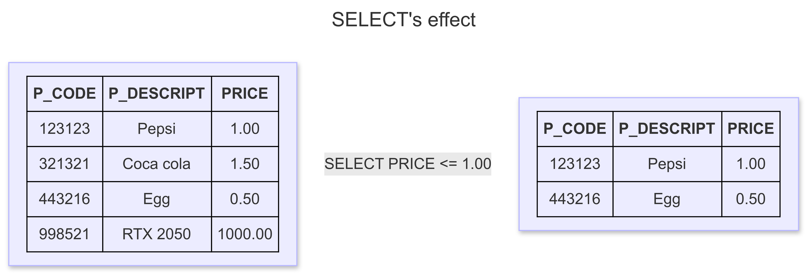

# Database Systems

Hello 👋

In this blog post, I'll be diving deep into relational database design, which remains the cornerstone of modern database management systems. As one of the most widely used database types, relational databases are behind many critical systems you interact with daily, whether you're making an online purchase, managing your finances, or accessing a web application.

## What Is A Database?

A database is an organized collection of data, designed to model a specific organizational process or system. Databases allow users to store, manage, and retrieve data efficiently. Whether you're using a simple spreadsheet to track personal expenses or a complex database management system to handle millions of records for a large enterprise, the underlying idea is the same—data is stored in a structured way to meet a specific goal or need.

Databases are typically categorized into two types: **operational databases** and **analytical databases**.

### Operational Databases

Operational databases are designed to handle **online transaction processing (OLTP)**, meaning they manage day-to-day operations of an organization. These databases are dynamic, with frequently changing data that reflects up-to-the-minute information. For instance, when you make a purchase online, your transaction data is stored in an operational database, which updates inventory and processes the order in real-time. These systems are optimized for fast, real-time data retrieval and updates.

### Analytical Databases

In contrast, analytical databases are built for **online analytical processing (OLAP)**, used primarily for analyzing large amounts of historical data. These databases track long-term trends, perform complex queries, and support business intelligence tasks. Data in analytical databases is typically **static**, meaning it doesn't change once it's recorded. Industries like finance, marketing analytics, and scientific research often rely on analytical databases to make informed business or research decisions based on historical patterns.

## The Relational Database

Invented in 1969 by **Dr. Edgar F. Codd**, the relational database model revolutionized how data is stored and queried. Dr. Codd, an IBM researcher with a background in mathematics, envisioned a new way to manage data that minimized redundancy, increased data integrity, and was independent of physical storage methods. His relational model was first presented in his 1970 paper _"A Relational Model of Data for Large Shared Data Banks"_.

At its core, the relational database is based on two main mathematical concepts: **set theory** and **first-order predicate logic**. The term "relational" itself is derived from set theory, where data is organized into sets of tuples (or records), and these sets can be manipulated using logical operations.

In a relational database:

- Data is stored in **relations**, commonly known as **tables**.
- Each table consists of **tuples** (also called records or rows) and **attributes** (or columns).
- The order of records and fields within a table does not affect the data's integrity, which ensures that the data is independent of how it's physically stored.

This independence from physical storage allows relational databases to offer a powerful abstraction: you don't need to know where or how the data is stored in order to retrieve it, which simplifies querying and management.

### Types of Relationships in Relational Databases

Relational databases define three basic types of relationships between tables:

1. **One-to-One**: Each record in one table is linked to a single record in another table.
2. **One-to-Many**: A single record in one table can be related to multiple records in another table.
3. **Many-to-Many**: Multiple records in one table can be linked to multiple records in another table.

These relationships are typically established by shared attributes (fields), with foreign keys ensuring that data is consistent across related tables. Understanding and properly managing these relationships is crucial for maintaining the integrity and performance of a database.

### Relational Database Management Systems (RDBMS)

A **relational database management system (RDBMS)** is software that facilitates the creation, management, and querying of relational databases. RDBMS platforms provide tools for users to define the structure of the database, insert and modify data, and execute queries to retrieve information. They also enforce integrity constraints, manage security, and often provide features for transaction processing and backup.

Popular RDBMS examples include:

- **PostgreSQL**: Known for its advanced features and extensibility.
- **MySQL**: A widely-used open-source RDBMS that is popular in web development.
- **SQLite**: A lightweight, serverless RDBMS ideal for local storage in mobile apps or desktop software.

The quality and performance of an RDBMS depend largely on how well it adheres to the relational model, ensuring that operations like querying, updating, and deleting data are both efficient and consistent.

## Terminology

Before diving into the design process of relational databases, it's crucial to understand certain terminology. These terms are foundational to the way relational databases function. Broadly speaking, relational database terminology can be classified into four categories: **value-related**, **relationship-related**, **structure-related**, and **integrity-related**.

### Value-Related Terms

#### Data

**Data** refers to raw facts that are stored in a database. These facts are typically **static**, meaning they remain in the same state until they are modified. Data is the basic unit of storage, and it doesn't have any inherent meaning until processed. In the context of a database, data could be things like customer names, product prices, or transaction dates.

The key idea here is that **data by itself does not reveal its significance**—it needs to be processed to turn it into something useful, like information.

#### Information

**Information** is the outcome of processing data to give it context and meaning. Unlike data, information is **dynamic**, because it changes based on the underlying data. When you retrieve information from a database, for example through an SQL SELECT query, you're transforming raw data into something that's useful or meaningful.

A simple way to remember the difference:

> **Data is what you store. Information is what you retrieve.**

#### Null

**Null** represents a missing or unknown value in a database. It's important to note that **Null is not the same as zero** or an empty string. While zero might represent something (like a balance of zero in an account), an empty string could indicate a user leaving a field blank, both of which are meaningful in their own right. However, **Null simply indicates the absence of any data**.

#### The Value of Null

Null has its place when dealing with missing or undefined values. For instance:

- **Missing values** occur when a piece of information is absent, like forgetting to input a client's country name during data entry.
- **Unknown values** may arise when information is not yet available, such as when a client forgets their country name.

In certain situations, Null can also be used to represent something that is not applicable. However, in cases like these, it's often more helpful to use specific values like "N/A" (Not Applicable) instead of Null to provide clearer context.

#### The Problem with Null

While Null is useful, it does have some drawbacks, especially when performing mathematical or logical operations. For example, any arithmetic operation involving Null will return Null, which can lead to unexpected results. If a calculation involves missing data (such as "1 + Null"), the result is logically uncertain, so it will also be Null.

This issue is something that will be considered during the database design process, especially when dealing with aggregates and calculations.

### Structure-Related Terms

#### Table

In a relational database, **data is stored in tables**, which are also referred to as **relations**. A table is essentially a collection of records (or tuples), organized by fields (or attributes). Tables represent specific subjects in a database, and the data within them must be logically organized.

The order of records and fields doesn't matter—what is crucial is the uniqueness of data and the relationships between tables. A table must always contain at least one **primary key** to uniquely identify each record.

#### Field

A **field** (or **attribute**) represents a specific characteristic of the subject represented by the table. For example, in a table of employees, fields might include **Name**, **Email**, **Phone Number**, and **Address**. Fields store actual data, and each field should contain one value—this is part of maintaining a **normalized** database structure.

Common issues arise when fields are poorly designed, such as:

1. **Multipart fields**: A field that contains multiple distinct values (e.g., a full address in a single field).
2. **Multivalued fields**: A field that contains multiple values of the same type (e.g., multiple phone numbers stored in one field).
3. **Calculated fields**: Fields that derive their values from expressions or calculations, like a total price field in an order table.

#### Record

A **record** (or **tuple**) is a complete set of data entries, consisting of one or more fields, that represents a specific instance of the subject of the table. For instance, a record in an "Employees" table would represent an individual employee and contain fields like **Name**, **Email**, and **Phone Number**. Each record is uniquely identifiable by a **primary key**.

#### View

A **view** is a "virtual" table that is generated by querying data from one or more base tables. Unlike a regular table, a view does not store data itself—it only presents data from the underlying tables in a specific format. Views are useful for simplifying complex queries, hiding sensitive data, or combining data from multiple tables.

For example, a view might present a combination of customer and order details from separate tables, allowing you to quickly access combined information.

It's important to note that views can be created in various ways, and while many databases support them, some support **indexed views**, which are stored physically for performance optimization.

#### Keys

In relational databases, **keys** are special fields used to identify and establish relationships between tables. The most important keys are **primary keys** and **foreign keys**.

- A **primary key** is a field (or combination of fields) that uniquely identifies each record in a table. No two records in the table can have the same primary key value.
- A **foreign key** is a field that links one table to another by referencing the primary key in a related table. Foreign keys help enforce referential integrity, ensuring that data is consistently linked between tables.

#### Index

An **index** is a database structure used to improve the speed of data retrieval operations. While an index doesn't change the logical structure of the database, it helps databases quickly locate records by creating an optimized search path for queries. However, an index is not a key, although they both serve to improve query performance.

### Relationship-Related Terms

A **relationship** between tables occurs when records in one table can be linked to records in another. These relationships are formed using **primary keys**, **foreign keys**, or a **linking table** (especially for many-to-many relationships). Understanding these relationships is essential for designing a well-structured database.

#### Types of Relationships

There are three main types of relationships between tables:

1. **One-to-One (1:1)**
2. **One-to-Many (1:M)**
3. **Many-to-Many (M:M)**

#### One-to-One (1:1) Relationship

In a **one-to-one** relationship, each record in Table A is linked to at most one record in Table B, and vice versa. This relationship can be used when, for example, each employee has a unique office assigned to them, and each office is assigned to only one employee.

To implement a one-to-one relationship, the **primary key** of one table can be used as a **foreign key** in the other table, or both tables can share the same primary key.

#### One-to-Many (1:M) Relationship

A **one-to-many** relationship occurs when a single record in Table A can be linked to multiple records in Table B, but each record in Table B is related to only one record in Table A. This is one of the most common relationships in databases. For example, an **author** can write **multiple books**, but each **book** is written by only one **author**.

In a one-to-many relationship, the **primary key** of the "one" side (Table A) is placed as a **foreign key** in the "many" side (Table B).

#### Many-to-Many (M:M) Relationship

In a **many-to-many** relationship, multiple records in Table A can be related to multiple records in Table B. Since relational databases don't support direct many-to-many relationships, a **linking table** (or **associative table**) is used. This table contains **foreign keys** referencing the primary keys of both related tables, creating a bridge between them.

For example, if a **student** can enroll in many **courses**, and a **course** can have many **students**, a linking table like **Enrollments** would contain **student_id** and **course_id** as foreign keys.

#### Types of Participation

**Mandatory participation** occurs when a record in one table must exist before a related record in another table can be added. In contrast, **optional participation** means that a record in the related table is not necessarily required.

#### Degree of Participation

The **degree of participation** refers to the number of records in one table that can be associated with a single record in a related table. For instance, one student may have anywhere from 1 to 5 enrolled courses, which defines the degree of participation for the relationship between **Students** and **Courses**.

### Integrity-Related Terms

#### Field Specification

A _field specification_ (also known as _domain_) defines the characteristics and constraints of a field in a database. It is made up of three components:

- _General elements_: These provide fundamental information about the field, including its _name_, _description_, and _parent table_.
- _Physical elements_: These describe how the field is implemented and presented to users, covering aspects like _data type_, _length_, and _character support_.
- _Logical elements_: These define the values that the field can contain, such as _required values_, _value ranges_, and _null support_.

#### Data Integrity

_Data integrity_ ensures that the data in a database is valid, consistent, and accurate. The accuracy of the data you retrieve is directly proportional to the level of data integrity enforced in the database.

There are four main types of data integrity you'll implement during the database design process. Three of these are related to specific aspects of the database structure, while the fourth focuses on how an organization uses its data. Here's a brief overview of each:

1. **Table-level integrity** (also known as _entity integrity_) ensures that each record in the table is unique, preventing duplicates, and guaranteeing that the field used to identify records (often the primary key) is always non-null.
2. **Field-level integrity** (also known as _domain integrity_) ensures that the structure of each field is valid, and that the data stored in the field is consistent, accurate, and within the expected range. It also ensures that fields of the same type are defined consistently across the database.
3. **Relationship-level integrity** (also known as _referential integrity_) ensures that the relationships between tables are properly maintained. This means that any changes made to data in one table (insertions, updates, or deletions) are synchronized with related tables, preserving the consistency of the database.
4. **Business rules** enforce constraints that are specific to the organization's needs. These rules can influence many aspects of the database design, including the types of values allowed in a field, the participation and degree of participation of tables in relationships, and the synchronization methods used for relationship-level integrity.

## Data Models

### Data Modeling and Data Models

Database design focuses on how the database structure will be used to store and manage data. **Data modeling** is the first step in designing a database, referring to the process of creating a specific data model for a requirement. A **data model** is a relatively simple representation, usually graphical, of more complex real-world data structures.

### Data Model Terminology

The basic building blocks of all data models are _entities_, _attributes_, _relationships_, and _constraints_.

- An **entity** is a person, place, thing, concept, or event about which data will be collected and stored.
- An **attribute** (or field) is a characteristic of an entity.
- A **relationship** describes an association among entities. There are 3 types of relationship as we discussed before.
- A **constraint** is a restriction placed on the data. Constraints are important because they help to ensure data integrity.

For example, the STUDENT entity has STUDENT_ID, FIRSTNAME, LASTNAME attribute. The CLASS and STUDENT entity bear a 1:M relationship, and the GPA of a student must be between 0.0 to 4.0 (the constraint).

### The Entity Relationship Model

Because it is easier to examine structures graphically than to describe them in text, database designers prefer to use a graphical tool in which entities and their relationships are pictured. Thus, the **entity relationship** model has become a widely accepted standard for data modeling.

Peter Chen first introduced the ER data model in 1976. The graphical representation of entities and their relationships in a database structure quickly became popular because it complemented the relational data model concepts. ER models are normally represented in an _entity relationship diagram_ (ERD), which uses graphical representations to model database components. You will learn how to use ERDs to design databases in the next section. The ER model is based on: Entity, attribute, and relationship.

#### Conceptual ERD Symbols

| Symbol                                                      | Name                  | Description                                                                                                                                                                                                                            |
| ----------------------------------------------------------- | --------------------- | -------------------------------------------------------------------------------------------------------------------------------------------------------------------------------------------------------------------------------------- |
|                               | Strong entity         | These shapes are independent from other entities, and are often called parent entities, since they will often have weak entities that depend on them. They will also have a primary key, distinguishing each occurrence of the entity. |
|                      | Weak entity           | Weak entities depend on some other entity type. They don't have primary keys, and have no meaning in the diagram without their parent entity.                                                                                          |
|         | Associated Entity     | Associative entities relate the instances of several entity types. They also contain attributes specific to the relationship between those entity instances.                                                                           |
|              | Relationship          | Relationships are associations between or among entities.                                                                                                                                                                              |
|          | Weak Relationship     | Weak Relationships are connections between a weak entity and its owner.                                                                                                                                                                |
|                         | Attribute             | Attributes are characteristics of an entity, a many-to-many relationship, or a one-to-one relationship.                                                                                                                                |
|  | Multivalued Attribute | Multivalued attributes are those that are can take on more than one value.                                                                                                                                                             |
|          | Derived Attribute     | Derived attributes are attributes whose value can be calculated from related attribute values.                                                                                                                                         |

#### Physical ERD Symbols

The physical data model is the most granular level of entity-relationship diagrams, and represents the process of adding information to the database. Physical ER models show all table structures, including column name, column data type, column constraints, primary key, foreign key, and relationships between tables.

As shown below, tables are another way of representing entities. The key parts of Entity-relationship Tables are:

**Fields**

Fields represent the portion of a table that establish the attributes of the entity. Attributes are typically thought of as columns in the database that the ERD models.


In the image above, _InterestRate_ and _LoanAmount_ are both attributes of the entity that are contained as fields.

**Keys**

Keys are one way to categorize attributes. ER diagrams help users to model their databases by using various tables that ensure that the database is organized, efficient, and fast. Keys are used to link various tables in a database to each other in the most efficient way possible.

- Primary Keys: are an attribute or combination of attributes that uniquely identifies one and only one instance of an entity.
- Foreign Keys: are created any time an attribute relates to another entity in a one-to-one or one-to-many relationship.


Each car can only be financed by one bank, therefore the primary key BankId from the Bank table is used as the foreign key FinancedBy in the Car table. This BankID is able to be used as the foreign key for multiple cars.

#### Cardinality and Ordinality notation


## The Relational Database Model

### Keys

In the relational model, keys are important because they are used to ensure that each row in a table is uniquely identifiable. They are also used to implement relationships among tables and to ensure the integrity of the data. A key consists of one or more attributes that determine other attributes. For example, an invoice number identifies all of the invoice attributes, such as the invoice date and customer's name.

### Dependencies

The role of a key is based on the concept of determination. **Determination** is the state in which knowing one attribute can makes it possible to determine the value of others. The idea of determination is not unique to the database environment. You are familiar with the formula `revenue - cost = profit`. This is a form of determination, because if you are given the revenue and the cost, you can determine the profit. Consider the STUDENT table, if you are given a value for STUDENT_ID, then you can determine the value of STUDENT_LNAME because one and only one value of STUDENT_LNAME is associated with any given value of STUDENT_ID. A specific terminology and notation are used to describe relationships based on determination. The relationship is called **functional dependence**, which means that the value of one or more attributes determines the value of one or more other attributes.

The standard notation for representing the relationship between STUDENT_ID and STUDENT_LNAME is as follow:

STUDENT_ID → STUDENT_LNAME

In this notation:

- STUDENT_ID is called **determinant**.
- STUDENT_LNAME is called **dependent**.

The attribute whose value determines another is called the **determinant** or the key. The attribute whose value is determined by the other attribute is called the **dependent**.

As stated earlier, functional dependence can involve a determinant that comprises more than one attribute and multiple dependent attributes. Refer to the STUDENT table for the following example:

STUDENT_ID → (STUDENT_LNAME, STUDENT_FNAME, STUDENT_GPA)

### Types of keys

Recall that a key is an attribute or group of attributes that can determine the values of other attributes. Therefore, keys are determinants in functional dependencies. Several types of keys are used in the relational model, and you need to be familiar with them.

A composite key is a key that is composed of more than one attribute. An attribute that is a part of a key is called a key attribute. For example:

STUDENT_ID → STUDENT_GPA
(STUDENT_LNAME, STUDENT_FNAME, STUDENT_INITIAL_MIDDLE, STUDENT_PHONE) → STUDENT_CREDIT_HOURS_EARNED

In the first functional dependency, STUDENT_ID is an example of a key composed of only one key attribute. In the second functional dependency, (STUDENT_LNAME, STUDENT_FNAME, STUDENT_INITIAL_MIDDLE, STUDENT_PHONE) is a composite key composed of four attributes.

A **super key** is a key that can uniquely identify any row in the table. In other words, a super key functionally determines every attribute in the row. In the STUDENT table, the STUDENT_ID is a super key, as are the composite keys (STUDENT_ID, STUDENT_LNAME). In fact, because STUDENT_ID alone is a super key, any composite key that has STUDENT_ID as a key attribute will also be a super key.

One specific type of super key is called a **candidate key**. A candidate key is a minimal super key. That is, a super key without any unnecessary attributes. A candidate key is based on a full functional dependency. Candidate keys are called _candidates_ because they are the eligible options from which the designer will choose when selecting the primary key. The primary key is the candidate key chosen to be the primary means by which the rows of the table are uniquely identified.

What is the _full functional dependency_?

Consider this table.

| Student_ID | Course_ID | Student_Name | Instructor |
| ---------- | --------- | ------------ | ---------- |
| 101        | CS101     | Alice        | Dr. John   |
| 102        | CS102     | Bob          | Dr. Smith  |
| 101        | CS102     | Alice        | Dr. Smith  |

- Full functional dependency: (Student_ID, Course_ID) → Instructor

  - To determine the _Instructor_, we need both Student_ID and Course_ID. If we only take one, we can't determine the Instructor.

- Partial Dependency: Student_ID → Student_Name

  - Student_Name only depend on Student_ID, Course_ID is not necessary. Thus, we can remove Course_ID.

This is absolutely important concept you need to understand. You will understand this to dive deeper into database normalization.

**Entity integrity** is the condition in which each row (entity instance) has its own known, unique identity. To ensure entity integrity, the primary key has two requirements:

1. All of the values in the primary key must be unique.
2. No key attribute in the primary key can contain a null.

In addition to its role in providing a unique identity to each row in the table, the primary key may play an additional role in the controlled redundancy that allows the relational model to work. **Foreign key** is the primary key of one table that has been placed into another table to create a common attribute. Foreign keys are used to ensure **referential integrity**, the condition in which every reference to an entity instance by another entity is valid. In other words, every foreign key entry must either be null or a valid value in the primary key of the related table.

Finally, **secondary key** is defined as a key that is used strictly for data retrieval purposes and does not require a functional dependency. Clearly, secondary keys are different from the other keys as we discussed before because they do not require the determinant to determine a unique value of the dependent. However, they are very important in the database environment. Suppose that customer data is stored in a CUSTOMER table in which the customer number is the primary key. Do you think that most customers will remember their numbers? Data retrieval for a customer is easier when the customer's last name and phone number are used. In that case, the primary key is the customer number, the secondary key is the combination of the customer's last name and phone number. Keep in mind that a secondary key does not necessarily yield a unique outcome. For example, a customer's last name and home telephone number could easily yield several matches in which one family lives together and shares a phone line. A less efficient secondary key would be the combination of the last name and zip code, this could yield dozens of matches, which could then be combed for a specific match.

Summary:

| Key Type      | Description                                                                                                                        |
| ------------- | ---------------------------------------------------------------------------------------------------------------------------------- |
| Primary key   | A candidate key selected to uniquely identify all other attribute values in any given row. Cannot contain null entries.            |
| Foreign key   | An attribute or combination of attributes in one table whose values must either match the primary key in another table or be null. |
| Super key     | An attribute or combination of attributes that uniquely identifies each row in a table.                                            |
| Candidate key | A minimal superkey. A superkey that does not contain a subset of attributes that is itself a superkey.                             |
| Secondary key | An attribute or combination of attributes used strictly for data retrieval purposes.                                               |

### Integrity rules

Relational database integrity rules are the foundation of good database design. Relational database management systems can enforce integrity rules automatically, but it is important to make sure your application design also conforms to the entity and referential integrity rules.

| Entity integrity | Description                                                                                                                         |
| ---------------- | ----------------------------------------------------------------------------------------------------------------------------------- |
| Requirement      | ALl primary keys entries are unique, no part of a primary key may be null.                                                          |
| Purpose          | Each row will have a known, unique identity, and foreign key values can properly reference primary key values.                      |
| Example          | No invoice can have a duplicate number, nor can it be null. In short, all invoices are uniquely identified by their invoice number. |

| Referential integrity | Description                                                                                                                                                                                                                                                                                                                                                                                                         |
| --------------------- | ------------------------------------------------------------------------------------------------------------------------------------------------------------------------------------------------------------------------------------------------------------------------------------------------------------------------------------------------------------------------------------------------------------------- |
| Requirement           | A foreign key may have either a null entry, as long as it is not a part of its table's primary key, or an entry that matches the primary key value in a table to which it is related.                                                                                                                                                                                                                               |
| Purpose               | The purpose is to ensure that every reference by a foreign key is a valid reference to the related primary key. It's possible for an attribute not to have a corresponding value, but it will impossible to have an invalid entry. The enforcement of the referential integrity rule makes it impossible to delete a row in one table whose primary key has mandatory matching foreign key values in another table. |
| Example               | A customer might not yet have an assigned sales representative (number), but it will be impossible to have an invalid sales representative (number).                                                                                                                                                                                                                                                                |

### Relational algebra

The data in relational tables is of limited value unless the data can be manipulated to generate useful information. This section describes the basic data manipulation capabilities of the relational model. **Relational algebra** defines the theoretical way of manipulating table contents using relational operators. You will learn more about SQL commands can be used to accomplish relational algebra operations later.

#### Formal Definitions and Terminology

Recall that the relational model is actually based on mathematical principles and manipulating the data in the database can be described in mathematical terms. Before considering the specific relational algebra operators, it is necessary to formalize your understanding of a table.

One important aspect of using the specific term _relation_ is that it acknowledges the distinction between the relation and the relation variable, or _relvar_, for short. A relation is the data that you see in your tables. A **relvar** is a variable that holds a relation. For example, imagine you were writing a program and created a variable named _i_ for holding integer data. The variable itself is not an integer itself, it's just a container for holding the integer. Similarly, when you create a table, the table structure holds the table data. The structure is properly called a relvar, and the data in the structure would be a relation.

A relvar has two parts: the heading and the body. The relvar heading contains the names of the attributes, while the relvar body contains the relation.

#### Relational Set Operators

The relational operators have the property of closure. That is, the use of relational algebra ­operators on existing relations (tables) produces new relations. Numerous operators have been defined. Some operators are fundamental, while others are convenient but can be derived using the fundamental operators. In this section, the focus will be on the SELECT (or RESTRICT), PROJECT, UNION, INTERSECT, DIFFERENCE, PRODUCT, JOIN, and DIVIDE operators.

**Select (or restrict)**

Select or restrict is referred to as an unary operator because it only uses one table as input. It yields values for all rows found in the table that satisfy a given condition. Select can be used to list all of the rows, or it can yield only rows that match a specific criterion. In other words, SELECT yields a horizontal subset of a table. SELECT will not limit the attributes returned so all attributes of the table will be included in the result.



Formally, SELECT is denoted by the lowercase Greek letter sigma ($`\sigma`$). Sigma is followed by the condition to be evaluated (called a predicate) as a subscript, and then the relation is listed in parentheses. For example, to SELECT all of the rows in the CUSTOMER table that have the value "10010" in the CUS_CODE attribute, you would write the following:

```math
\sigma_{\text{CUS\_CODE}=10010}(\text{CUSTOMER})
```

**Project**

PROJECT yields all values for selected attributes. It's also an unary operator. PROJECT will return only the attributes requested, in the order in which they are requested. In other words, PROJECT yields a vertical subset of a table. PROJECT will not limit the rows returned, so all rows of the specified attributes will be included in the result.


Formally, PROJECT is denoted by the Greek letter pi ($`\pi`$). Pi is followed by the list of attributes to be returned as subscripts and then the relation listed in parentheses. For example, to PROJECT the CUS_FNAME and CUS_LNAME in CUSTOMER table, you would write the following:

```math
\pi_{\text{CUS\_FNAME, CUS\_LNAME}}(\text{CUSTOMER})
```

Because relational operators have the property of closure, that is, they accept relations as input and produce relations as output, it is possible to combine operators. For example, you can combine the two previous operators to find the first and last name of the customer with customer code 10010:

```math
\pi_{\text{CUS\_FNAME, CUS\_LNAME}}(\sigma_{\text{CUS\_CODE=10010}}(\text{CUSTOMER}))
```

**Union**

UNION combines all rows from two tables, excluding duplicate rows. To be used in the UNION, the tables must have the same attribute characteristics. In other words, the columns and domains must be compatible. When two or more tables share the same number of columns, and when their corresponding columns share the same or compatible domains, they are said to be union-compatible.


UNION is denoted by the symbol $`\cup`$. If the relations SUPPLIER and VENDOR are union-­compatible, then a UNION between them would be denoted as follows:

```math
\text{SUPPLIER} \cup \text{VENDOR}
```

It is rather unusual to find two relations that are union-compatible in a database. ­Typically, PROJECT operators are applied to relations to produce results that are union-­compatible. For example, assume the SUPPLIER and VENDOR tables are not union-­compatible. If you want to produce a listing of all vendor and supplier names, then you can PROJECT the names from each table and then perform a UNION with them.

```math
\pi_\text{SUPPLIER\_NAME}(\text{SUPPLIER}) \cup \pi_\text{VENDOR\_NAME}(\text{VENDOR})
```

**Intersect**

INTERSECT yields only the rows that appear in both tables. As with UNION, the tables must be union-compatible to yield valid results.


INTERSECT is denoted by the symbol $`\cap`$. If the relations SUPPLIER and VENDOR are union-compatible, then an INTERSECT between them would be denoted as follows:

```math
\text{SUPPLIER} \cap \text{VENDOR}
```

Just as with the UNION operator, it is unusual to find two relations that are union-compatible in a database, so PROJECT operators are applied to relations to produce results that can be manipulated with an INTERSECT operator. For example, again assume the SUPPLIER and VENDOR tables are not union-compatible. If you want to produce a listing of any vendor and supplier names that are the same in both tables, then you can PROJECT the names from each table and then perform an INTERSECT with them.

```math
\pi_\text{SUPPLIER\_NAME}(\text{SUPPLIER}) \cap \pi_\text{VENDOR\_NAME}(\text{VENDOR})
```
